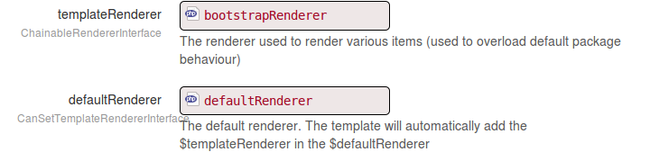

Renderers for template developers
=================================

If you are developing a template, you might want, just like a package developer to offer
objects using the rendering engine, or you might also want to overload default rendering of some packages
your template is using.

Templates renderer are a bit special. Unlike [package renderers](for_package_developers.md), template renderers
are not automatically picked by the "default" renderer. Instead, they need to be activated manually.
Why? Because you might want to have many templates in the project, and we don't want a template renderer to interfere
with another template renderer.

As a template developer, you will therefore have to **register your renderer** in the default renderer.

Registering your template
-------------------------

If you are developing your own [Mouf template](http://mouf-php.com/packages/mouf/html.template.templateinterface/README.md), 
it is likely you are extending the <code>BaseTemplate</code> class for your template class.
The <code>BaseTemplate</code> class comes with 2 properties:

- **defaultRenderer**: the default renderer (main renderer used by the rendering engine)
- **templateRendererInstanceName**: the container identifier of the instance of the renderer for this template

Basically, in your template instance, you should end up with something looking like this (this is a snapshot from the BootstrapTemplate):



Now, when the <code>toHtml()</code> method of your template is called, you should register your template.
To do this, you just need to add one line at the top of your <code>toHtml()</code> method.

```php
public function toHtml(){
	// Let's register the template renderer in the default renderer.
	$this->getDefaultRenderer()->setTemplateRendererInstanceName($this->getTemplateRendererInstanceName());

	// Here goes the rest of your code.
	...	
}
```

Writing the template installer
------------------------------

Most of the time, you will want to create a default template instance when your package is installed.

Assuming you are using container-interop/service-provider and thecodingmachine/funky, your service provider will look like this:

```php
class BootstrapTemplateServiceProvider extends ServiceProvider
{
    /**
     * @Factory(aliases={TemplateInterface::class})
     */
    public function createBootstrapTemplate(CanSetTemplateRendererInterface $templateRenderer, ContainerInterface $container, WebLibraryManager $webLibraryManager): BootstrapTemplate
    {
        $bootstrapTemplate = new BootstrapTemplate($templateRenderer, "bootstrapTemplateRenderer");
        // Some init stuff
        // ...
        return $bootstrapTemplate;
    }

    /**
     * @Factory(name="bootstrapTemplateRenderer")
     */
    public function createTemplateRenderer(CacheInterface $cache, ContainerInterface $container, \Twig_Environment $twig): FileBasedRenderer
    {
        return new FileBasedRenderer(__DIR__.'/../../../templates/', $cache, $container, $twig);
    }
}
``` 
